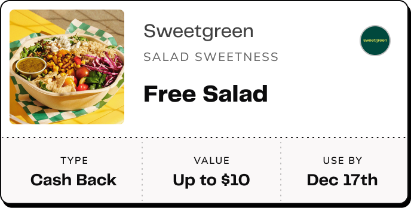

# Mobile Demo (Web Version)

## Project Overview

This project is a web-based version of a profile card feature, originally designed for React Native. It displays a user profile card with information fetched from a GraphQL API using Apollo Client. The project has been adapted to run in a browser using React and Create React App.

## Getting Started

### Prerequisites

Make sure you have the following installed:
- **Node.js** (version 14 or higher)
- **npm** (comes with Node.js)

### Setup

1. **Clone the Repository**
   ```bash
   git clone https://github.com/milesdayoub/react-demo-new
   cd react-demo-new
   ```

2. **Install Dependencies**
   ```bash
   npm install
   ```

3. **Run the App**
   ```bash
   npm start
   ```

   This command will start the development server, and you can view the app in your browser at [http://localhost:3000](http://localhost:3000).

## Project Structure

- **`src/ApolloClient.ts`**: Configures Apollo Client to connect to the GraphQL API, with an auth token and user ID for authentication.
- **`src/ProfileListCard.tsx`**: Contains the `ProfileListCard` component, which fetches data and displays a profile card based on a given `pk` prop.
- **`src/App.tsx`**: The main entry point, where the `ProfileListCard` component is rendered within an ApolloProvider.

## Available Scripts

In the project directory, you can run:

- **`npm start`**: Runs the app in development mode.
- **`npm test`**: Launches the test runner in interactive watch mode.
- **`npm run build`**: Builds the app for production.
- **`npm run eject`**: Ejects from Create React App’s default configuration.

## ProfileListCard Component

The `ProfileListCard` component uses the following GraphQL query to fetch profile data:

```graphql
query ProfileListCard($pk: Int!) {
  token_by_pk(pk: $pk) {
    pk
    metadata {
      id
      image
      name
      value
      value_type
      expiration_datetime
    }
    contract {
      metadata {
        id
        type
        benefit_tldr
        brand {
          id
          image_url
          name
        }
      }
    }
  }
}
```

### TODOs for Candidates
1. **Display Data**: Structure and style the profile card using the data fields such as `title`, `subtitle`, `rewardImageUrl`, `type`, `value`, `expirationDatetime`, `brandName`, and `brandImageUrl`.



1. **Handle Navigation**: Implement any necessary navigation actions for the card if required.

## Styling

The project includes a basic CSS file (`App.css`). The `.container` class replicates the React Native style configuration with `flex` alignment properties to center content:

```css
.container {
  display: flex;
  flex: 1;
  background-color: #fff;
  align-items: center;
  justify-content: center;
  min-height: 100vh;
}
```

## Learn More

To learn more about using React and Apollo Client, check out the official documentation:

- [React Documentation](https://reactjs.org/)
- [Apollo Client Documentation](https://www.apollographql.com/docs/react/)
